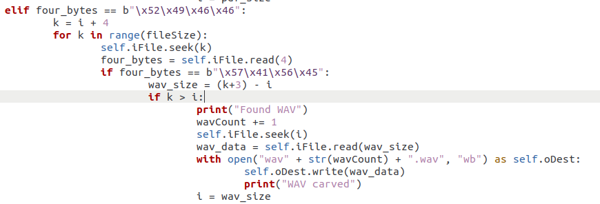
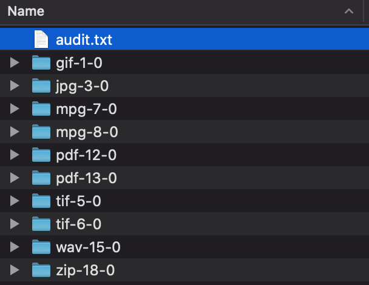

# Forensics Lab 02 - File Carving and Steganography
This lab is an introduction to hiding and extracting secret information using steganography, 
and to introduce you to file carving using tools such as Scalpel.
Students will implement a class in Python to extract files from an image of a hard drive or USB stick. After completing the Python program, you will use the
popular file carving tool *scalpel* to recover files. 
Then you will utilize steghide to find hidden data.

### Part 1 - File Carving Python
To run my carver, run the command 'python3 Toolkit.py carver -i part1and2.dd'. The output will go to whatever directory you are currently in. I wasn't able to figure out how to write the carved files to a desginated output folder. 

For my Carver, I looked up a PNG carver to see how the logic of file carving worked. Once I was able to get the PNG carver to work within my Toolkit, I moved on to the PDF carver. I used the same logic as the PNG carver, with a few tweaks because PDFs do not have specific bytes to indicate the size of the file size.

For the PDF carver, after I found the first four bytes indicating there was a PDF, I then created another for look to cycle through the other bytes in the flash drive to find the five bytes that indicated the ending of the PDF. I then found the file size, checked to make sure it was positive and then extracted the file. 

The WAV carver was very similar to the PDF carver

**Q1:** How many files were you able to pull off the flash drive image? What file types were they?
- 12 files in total
- 5 PDFs
- 4 PNGS
- 2 WAVs

**Q2:** Did some of the files not render correctly? What types of files were they? Why would this happen?
 - None of the files seemed to render incorrectly
 
### Part 2 - Scalpel

**Q3:** What changes did you make to the scalpel configuration file?
- Uncommented the files types I found with my carver and other random file types I thought might be present

**Q4:** Did scalpel detect file types that your carver did not?
- Yes
- Scalpel found gifs, jpgs, mpgs, tifs, and zips

**Q5:** Did scalpel or your carver find more files? How many more?
- Scalpel found more files than my carver
- Scalpel found 8 more 

**Q6:** Why would this tool ever be useful?
- To carve hidden files within a flash drive

### Part 3 - Steghide
The instructor has given you a second flash drive image that contains some very important flags. Happy flag hunting! A flag is a string in the format of flag{this_is_a_flag}

**Q7:** What were the locations of the flags?
- 1 flag was found within a text file hidden in the "legendofzelda.wav"
  - This file was found by mounting the flash drive image
- 1 flag was found by within a text file hidden in the "titanic.jpg"
  - The corrupted jpeg was found by mounting the flash drive image
- 1 flag was found within a python script file hidden in a python meme jpeg
  - This jpeg was found using Scalpel
- 1 flag was found within atext file hidden in a jpeg or Eleven from Stranger Things
  - This jpeg was found using Scalpel

**Q8:** What were each of the flags?
- flag{hero_of_hyrule}
- flag{the_penguins_were_behind_the_titanic}
- python3isbetter
- flag{i_love_eggos}

**Q9:** What were each of the passwords to extract the embedded data?
- flag{hero_of_hyrule}
  - Password: link
  - 
- flag{the_penguins_were_behind_the_titanic}
  - Password : the_penguins
  - 
- python3isbetter
  - Password : python
- flag{i_love_eggos}
  - Password : upsidedown
  - 

**Q10:** List any other relevant data (cracked passwords, changes to the configuraton files, etc.)
- I uncommented another line in the scapel config
- I used JTR to find the passwords from the passwd and shadow file in the file given to us
  - root : toor
  - garret : python

