# Lab 06 - Linux Memory Investigation
This lab demonstrates how to forensically acquire a memory capture from a Linux system
using LiME (Linux Memory Extractor) and analyze that RAM capture in Volatility. S

---

## Procedure<a name="procedure"></a>

### Part 1 - Setting up the Machines:
1.  Create a new Ubuntu virtual machine by creating a clone of the one you have used so far in class. Ensure that the box is connected to the internet. Limit the amount of RAM allocated to this VM to 1GB.

    - 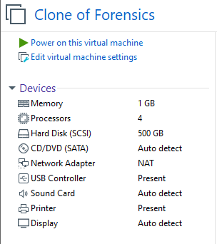

2.  Install VMWare tools using the `VM > Manage` menu and then
    following the on screen instructions.
    - VMware tools were already installed on my machine so I was able to skip this step

3.  Add a shared folder between the new VM and the host computer using the
    `VM > Settings.. > Options > Shared Folders` menu. The VM should be powered
    off during this step.

    - 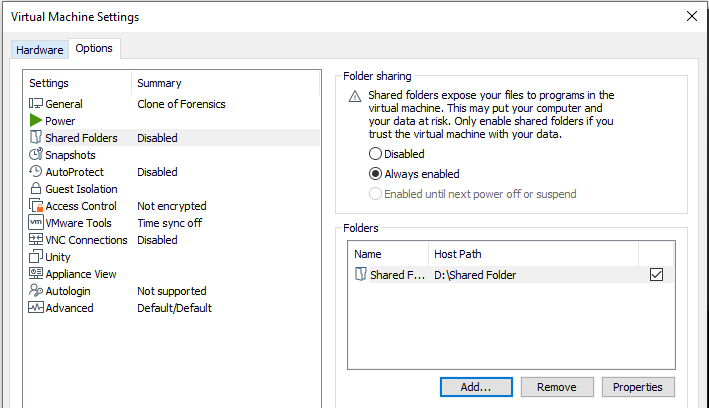

    - I did this for both machines

4.  On both Ubuntu machines run the bash commands `sudo apt update` and `sudo apt upgrade`
    to update the kernels to the most recent version. A restart is required for the kernel
    changes to take effect. You can double check that both machines are running
    the identical versions by running `uname -r`. Make note of the string printed,
    as it will be needed later in the lab.

    - 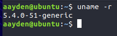

    - Both machines produced the same kernel version

5.  On your class Ubuntu VM, enable the root account and provide it a password by running the
    command `sudo passwd root`. By default, the root account is disabled on Ubuntu, but
    we must use the root account later on.

    - I ran the command and entered the password '6789'

6.  On the suspect's VM, use `sudo` to execute `populate_ram.sh` script provided in this repo.
    The script may take a few minutes to run and requires an internet connection. Don't worry
    about what the script is doing at this point; it's your job to figure that out later on
    with Volatility!

    - 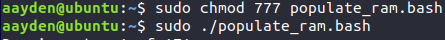

    - Before running the command, I had to change the permissions on the file to make it an executable.

### Part 2 - Creating the LiME Kernel Module and Acquiring RAM:
On your regular Ubuntu machine, follow these steps:
1. Clone the [LiME repo](https://github.com/504ensicsLabs/LiME) from Github.
2. Navigate to the `LiME/src/` directory
3. Run the `make` command.

This should generate the module `lime-KERNEL-VERSION.ko` where KERNEL-VERSION
is the string given by `uname -r`. Copy this file to the Shared Folder of the
suspect's VM. You are now ready to preform the capture!

From a console within the suspect's VM, insert and run the RAM acquisition kernel module
with the following command. This will store an image of the system's current memory
into a file called `ram.lime`.

```
sudo insmod /mnt/Shared\ Folder/lime-5.4.0-51-generic.ko "path=/mnt/Shared\ Folder/ram.lime format=lime"
```

### Part 3 - Adding a Volatility Profile:
On your regular Ubuntu VM, follow these steps to create the Volatility profile for the
suspect's memory image:
1.  Elevate to root using the `su` command.
2.  Find the installation path to Volatility. 
    - `/home/aayden/volatility`.
3.  From this directory, navigate to `tools/linux/`.
4.  Run `make` within this folder to create the first file needed for the profile,
    `module.dwarf`. 
5.  With that file created, run the following command to zip the required files into a
    Volatility profile and place it in the correct directory:

```
zip - `/home/aayden/volatility`./plugins/overlays/linux/Ubuntu1604.zip module.dwarf /boot/System.map-5.4.0-51-generic
```

### Part 4 - Volatility Questions:
1. What kernel version is the suspect's machine using? 
    - Linux version 5.4.0-51-generic
    - How I got the answers
        - I used the Volatility command `linux_banner`
    - 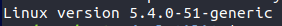

2. What is the IP address and MAC address of the suspect's machine? What vendor is associated
   with the system's MAC address?
   - IP address : 192.168.181.139
   - MAC address : 00:0c:29:48:8a:e2
   - The vendor associated with the MAC address is VMware
    - How I got the answers
        - I used the Volatility command `linux_ifconfig` to find the IP and MAC addresses. 
        - I did a simple reverse MAC address lookup online to find the vendor.

    - 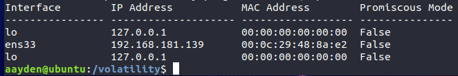

    - 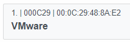

3. Identify a suspicious program running from the `/tmp` directory. What is this process's PID
   (Process ID) and name? What is the PID and name of the process's parent process?
    - There was only one process running in the `/tmp` directory and that was a process called 'calc' and its PID was 3910
    - The parent process was 'systemd' and its PID was 1068
    - How I got the answers
        - I used the Volatility command `linux_psaux` and looked for a process whose arguments involved the `/tmp` directory
        - I used the Volatility command `linux_pstree` and located 'calc' and moved up the tree until I found the parent process

    - 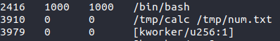

    - 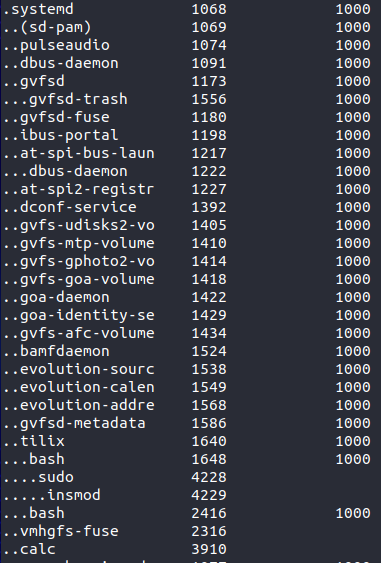

4. View the memory mappings of the identified process from the previous question. For this
   process, dump the contents of the heap to a file and the contents of the stack to a file.
   Save these memory dump files, as they will be included in your final deliverable. Examine the
   files in a hex editor. What file is this process writing output to? What is the purpose of
   the program?
   - The process is writing output to a file named 'num.txt' and it is writing the Fibonacci sequence
   - How I got the answers
        - I used the Volatility command `linux_proc_maps` with the option `-p 3910` to show only the maps related to the process 'calc'. This allowed me to see the starting addresses of the heap and stack.  
        - I used the Volatility command `linux_dump_map` with the options `-s 0x0000000001435000 --dump-dir lab6` to dump the contents of the heap into a folder labeled 'lab6'
        - I used the Volatility command `linux_dump_map` with the options `-s 0x00007ffee4de6000 --dump-dir lab6` to dump the contents of the stack into a folder labeled 'lab6'
        - After dumping the contents of both the stack and heap. I looked at both files in a hes editor to find anything interesting
    - 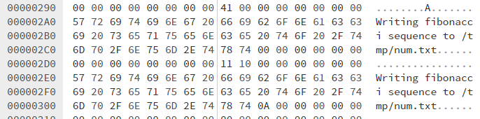

    - 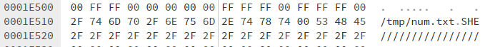

5. Confirm your result by using Volatility's `linux_lsof` command to list all of the files
   that were open by the process. Does the output of this command agree with your answer
   to question 4?
   - Yes, it agrees
   - 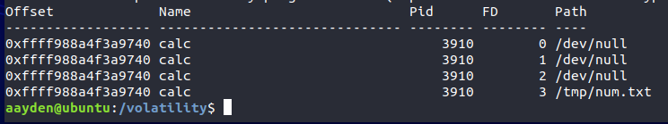

---
