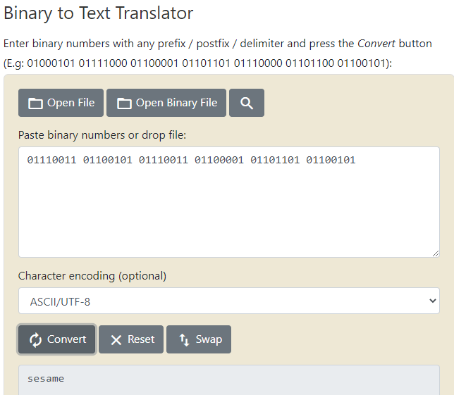

# Lab 08 - Mobile Forensic Investigation
This lab explores the pitfalls and challenges of mobile phone forensic investigation. 

---

### Part 1 - Mobile Forensic Tools Investigation:

#### Option 2
1. Describe the tool you used, why you chose it, what it can recover.
  - I used Andriller CE.
  - I chose this software because it has a collection of forensic tools that can perform read-only, forensically sound, non-destructive acquisition from Android phones.     
2. Describe methodology, challenges, and what you learned. Any surprises?
  - For this software, all i had to do was download and install it, according to the README instructions. When you run it a GUI comes up that is very simple and user friendly.
  - Once I had my phone plugged in and USB debugging on, I clicked the check button on the GUI which sent a request to my phone that I had to accept to authorize to software to extract data. 
  - I then clicked extract which made a pop-up window appear telling me what to do on my phone so that the software could extract the data.
  - From what I can understand, the software creates a backup of the phone and then reads that information into the multiple forensic tools that do all the work.
  - The software was able to see some of my calendar events that I have on my Google calendars. I also got a lot of app data, that I don't really know what to do with. I tried to find some files to decode with the included decoders. But found none.
  - I am surprised that there wasn't much to the report. It was very minimal and I don't know why.
  - There was a lot in the output folder, but it was tedious to look through. 
  - The decoders and other tools included in the software ended up being hard to use and not worth the time and effort required.

  * 
  * 
  * 

### Part 2 - Evidence Discovery in an Android Environment
1. Download and install **Android Studio** for your native OS.
2. Download the virtual device
3. You are in luck! The suspect has very greasy fingers. An investigator has captured a scan of the smudges left on the screen by the suspect. This may help you in unlocking the phone.
    * 
4. Loading the virtual device is not very intuitive. The contents of `avd.zip` must be extracted into `<path>\.android\avd` where the path is typically `\Users\<User Name>` in Windows.
    * Note: I had to change the directory within the included .ini file to the directory I placed the file
5. Once Android Studio is installed and the virtual device files are in the correct directory, the device can be accessed with the following steps:
    * Open Android Studio
    * Click on "Tools" on the menu bar
    * "AVD Manager"
    * You should see a device called "Pixel 2 API 29". If not, double check your files are placed in the correct directory.
    * Press the green play button. A virtual phone should load. It will start with a black screen and then boot after a few moments. Be patient.
6. You will need the screen smudge scan to decipher the passkey. If the phone goes to sleep while you try to figure out the passkey, you can wake it up with the power button.
    * 
7. Once you gain access, it should boot into Airplane mode. 
8. Manually search the phone for "Evidence". All evidence is labeled, but much of it is hidden. In general, you will know it when you see it.
9. Briefly document the evidence you find in your report, including how and where you found it and also any relevant metadata that might pertain to an investigation.
    * Evidence 1
      * I found this evidence by simply opening up the Gmail application on the phone and browsing through the emails in the main inbox.
      * Within, the email I found binary code that when decoded spelled the word 'sesame' and a zip file. 
      * After downloading the zip file from the phone, I extracted the files. The zip was password protected, so I tried 'sesame' since that was the word that was spelled out in binary and it worked! The zip file contained four pictures, all with "EVIDENCE?" printed on them. 
      * The email was sent from a person named Redd to the suspect on October 24th at 2:06pm with standard encryption
      * 
      * 
      * 

    * Evidence 2
      * I also found this piece of evidence within the emails in the Gmail application. This one took a little more digging to find though
      * After looking at the main inbox, I went down the list of labels and folders. I finally found more emails within the `All Mail` folder
      * The email contained one photo with the word "EVIDENCE" printed on it. 
      * The email was sent from the subject to a person named Pascal on October 24th at 2:10pm.
      * 
      * 
      * 

    * Evidence 3
      * This evidence was also found within the Gmail application. I found this one like the previous evidence, but instead of the `All Mail` folder, I found this email in the `Trash` folder
      * The email contained one photo with the word "EVIDENCE" printed on it.
        * The image would not load for me to screenshot it, but I could see the word "EVIDENCE'
      * The email was sent from the subject to a person named Drake on October 24th at 3:21pm.
      * 
      * 
    
    * Evidence 4
      * The next placed I looked for evidence was in the Photos application. 
      * I found this evidence by looking through the photos that are presented first in the application
      * The photo was the last one and seems to have been uploaded on October 22nd.
      * Looking at the information about the photo, I found the coordinates of the location the picture was taken at. I then took these coordinates and entered them into Google maps to find what was at that location
        * Coordinates: 36.151 -95.944
      * 
      * 
      * 

      * Evidence 5, 6, & 7
        * Still in the Photos application, I went to the Albums tab and looked through each album.
        * I found all of these pieces of evidence in the album labeled 'Download'.
        * Evidence 5 and 6 seemed to be taken on Saturday October 24th. While Evidence 7 seemed to be taken on Thursday October 22nd.
        * Looking at the information about the photo, I found the coordinates of the location the picture was taken at. I then took these coordinates and entered them into Google maps to find what was at that location
          * Coordinates - 5: 36.151 -95.944
          * Coordinates - 6: 36.151 -95.944
          * Coordinates - 7: No coordinates found
        * 
        * 
        * 
        * 
        * 
        * 
        * 
        * 

    * Evidence 8
      * I found this evidence in the Pictures album within the Photos application 
      * The photo was the last one and seems to have been uploaded on October 22nd.
      * Looking at the information about the photo, I found the coordinates of the location the picture was taken at. I then took these coordinates and entered them into Google maps to find what was at that location
        * Coordinates: 36.151 -95.944
      * 
      * 
      * 

    * Evidence 9
      * After looking at all the photos for evidence I went on to the text messages. 
      * The first message was from someone named Dom Indeedaroo and was sent Saturday October 24th at 3:07pm.
      * The message was encoded in Base64. I knew this because of the two equal signs at the end of the message which is the Base64 equivalent to a period. 
      * I copied the message and put into a Base64 to ASCII converter. After the first conversion, I still had a Base64 encoded message. So I copied that and converted it to find what the message said. 
      * 
      * 
      * 

    * Evidence 10 
      * The second message was from someone named Cesar Caesar and was sent Saturday October 24th at 12:23pm.
      * The message was encoded with a Caesar cipher. I knew based on the name of the person that sent the message and the resources provided to us. 
      * I copied the message and put into a Caesar cipher brute force decoder. This gave me multiple results, but the one that made sense was a the Caesar cipher using a shift of +17
      * 
      * 

    * Evidence 11
      * The third and final message was from someone named Chevre Vigenere and was sent Saturday October 24th at 12:35pm.
      * The message was encoded with a Vigenere cipher. I knew based on the name of the person that sent the message and the resources provided to us
      * I copied the message and put into Vingenere decoder and clicked automatic decryption. This gave me multiple results and I found the one that actually made a coherent sentence
      * 
      * 

10. If you believe you are finished acquiring evidence from the device, go ahead and turn "Airplane Mode" off and allow the device to connect to the internet. What happens?
  * A notification pops up from Google Play services saying that an account action is required. When you click on the notification it asks for the subjects Google password to log back in. 
---

## Requirements & Deliverables
#### A markdown report including the following:
* **Part 1**: 
  * A description of the tools you chose
  * What the tools require to use them
  * Instructions for using the tools
  * What materials they are able to acquire for you
  * Limitations on what the tools can achieve
  * If you choose **Option 2**, please include documentation of using one or more tools on personal devices. What sort of material could you find? Were there any surprises? Challenges?
  * _Note: Option 1 is primarily just a written report, with little practical experience, so the writing expectations are a bit higher. Option 2 is meant as a practical experience and so the writing expectation is more informal. Just show us what you learned._

## Student Guidance
* Please verify that you are able to install **Android Studio** and access the virtual device sooner rather than later.
* Sometimes the virtual phone crashes and closes during bootup, then works fine on the second try.
* Some of the evidence in **Part 2** might give you a little trouble. See the **Resources** section below for helpful tools.
* **It will not be necessary to use a hex-editor to search within files for evidence.**

## Resources
* https://github.com/den4uk/andriller
* https://www.reddit.com/r/computerforensics/comments/7d6yr2/iphone_and_ipad_forensic_software_suggestions/
* https://www.sleuthkit.org/autopsy/docs/api-docs/3.1/mod_mobile_page.html
* https://developer.android.com/
* https://www.rapidtables.com/convert/number/ascii-hex-bin-dec-converter.html
* https://cryptii.com/pipes/caesar-cipher
* https://www.dcode.fr/vigenere-cipher
