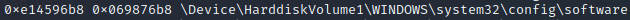
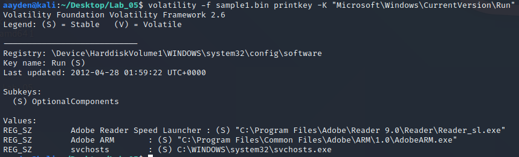
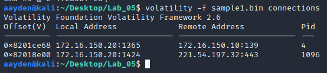

# Forensics Lab 05 - Windows Memory Investigation
The purpose of this Lab is to familiarize yourself with Volatility and some of its most
common plugins while performing analysis on Windows registry artifacts stored in memory.

---

## Procedure
Volatility is a collection of tools for the extraction of digital artifacts from volatile memory. The tools perform independently of the system but give great insight into the runtime state of the system

### Part 1 - Sample1.bin:
Run Volatility's *hivelist* plugin on **sample1.bin**.   

**Q1:** What's the virtual and physical address of the `HKEY_LOCAL_MACHINE\SOFTWARE` hive?
- Virtual: 0xe14596b8
- Physical: 0x069876B8

**Q2:** What's the virtual and physical address of the *administrator* user's `HKEY_CURRENT_USER` hive?  
- Virtual: 0xe10b9008
- Physical: 0x0cf25008

**Q3:** Use Volatility’s *printkey* plugin to check the `Microsoft\Windows\CurrentVersion\Run` key in `HKEY_LOCAL_MACHINE\SOFTWARE` hive identified in the questions above. Do you see any entries that are worth further investigation? Why? 

- The `svchost.exe` looks like it would be worth investigating more. `svchost.exe` is a normal executable found on Windows machines, but there should not be a file with that name within the Windows OS directory. It's also suspicious that the name closely resembles that of a normal Windows executable. 

**Q4:** Was Remote Desktop Protocol (RDP) enabled on sample1.bin? How can you tell?
- Yes, Remote Desktop Protocol was enabled.
- I was able to determine this by running the `sockets` command and looking to see if port 3389 was open. As you can see in the picture below, the port was open and listening. 

**Q5:** What information can you discover about sample1.bin's connection/networking history?
- TCP connections that were active at the time of memory acquisition
- Found by running the `connections` command
    - The `connections` command shows all TCP connections that were active at the time of the memory acquisition.

- Artifacts from previous connections and active ones
- Found by running the `connscan` command
    - The `connscan` command can find artifacts from previous connections that have been terminated, in addition to active ones by using pool tag scanning

- Listening sockets
- Found by running the `sockets` command
    - The `sockets` command detects listening sockets for any protocol. It walks a singly-linked list of socket structures. 

### Part 2 - Sample2.bin:
Determine what processes are active and what processes are terminated within **sample2.bin**

- All the processes shown are active, except 'cmd.exe' which shows that the process was exited
- Found by running the `pslist` and `psscan` commands
    - The `plist` command walks the doubly-linked list pointed to by PsActiveProcessHead and shows the offset, process name, process ID, the parent process ID, number of threads, number of handles, and date/time when the process started and exited. This command does not detect hidden or unlinked processes
    - The `psscan` command enumerates the processes using pool tag scanning. This can find processes that previously terminated (inactive) and processes that have been hidden or unlinked by a rootkit.

### Part 3 - Sample3.bin:
Use Volatility’s *hashdump* plugin to extract the cached password hashes within **sample3.bin**.

**Q6:** List the output line containing the administrator’s password’s hash. 

**Q7:** What is the administrator’s actual clear text password? Online hash crackers are not allowed for this question. Use the community-enhanced version of John the Ripper to crack the hashes.

- password

---

## References
* [Andrea Fortuna](https://www.andreafortuna.org/)

