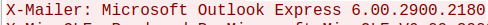

# Forensics Lab 07 - Wireshark
This lab exposes students to analyzing common network traffic and capturing live network traffic using Wireshark.  
You will be required to analyze and answer questions about 5 different network captures provided with this lab. 

## Required Tools
* [Wireshark](https://www.wireshark.org/)
* [Bless](https://apps.ubuntu.com/cat/applications/precise/bless/) or an equivalent hex editor
* 7-zip Utility
* [Python 3](https://www.python.org/downloads/)

---

## Procedure

### Part 1 - Telnet Capture
Analyze the provided Telnet pcap file and answer the following questions.
1. In general, what is Telnet used for?
- Telnet is generally used to virtually access a computer and provide a two-way text-based communication between two machines
2. What type of computer was logged into?
- Linux Mint Xfce Edition
3. What credentials (username and password) were used to access the computer?
- Username: johnny
- Password: guns and drums and drums and guns
4. What commands were executed on the computer over the Telnet session?
- exit

### Part 2 - FTP Capture
Analyze the provided FTP pcap file and answer the following questions.
1. In general, what is FTP used for?
- Generally, FTP is used to transfer files from one system to another over the internet
2. What type of FTP server was accessed?
- vsFTPd 
3. What credentials (username and password) were used to login to the FTP server?
- Username: johnny
- Password: guns and drums and drums and guns
4. What file was downloaded from the FTP server?
- [important_image.jpg](./Part2/important_image.jpg)

### Part 3 - HTTP Capture
Analyze the provided HTTP pcap file and answer the following questions.
1. In general, what is HTTP used for?
- Generally, HTTP is used by a server to challenge a client request and by a client to provide authentication information
2. What host is being connected to over the HTTP connection?
- initechsecurity.com
3. At what date and time was the website accessed?
- Friday Nov. 7th, 2014 at 22:01
4. What password is used to access images on the website?
- password666
- 
5. What is the name of the last file downloaded on the website?
- output.7z
    - [picture1.jpg](./Part2/picture1.jpg)
    - [picture2.jpg](./Part2/picture2.jpg)
    - [picture3.jpg](./Part2/picture3.jpg)

### Part 4 - SMTP Capture
Analyze the provided SMTP pcap file and answer the following questions.
1. In general, what is SMTP used for?
- Generally, SMTP is used to send emails
2. How many emails were sent, at what date and time were they sent, and what email addresses
   were they sent between?
- Two emails were sent
- First email
    - Saturday October 10th, 2009 at 7:35
    - Sender: sneakyg33k@aol.com
    - Receiver: sec558@gmail.com
    - 
- Second email
    - Saturday October 10th, 2009 at 7:38
    - Sender: sneakyg33k@aol.com
    - Receiver: mistersecretx@aol.com
    - 
3. What email client was used to send the emails?
- Microsoft Outlook Express
- 
4. What credentials (email address and password) were used for *Ann Dercover's* email?
- Email: sneakyg33k@aol.com
- Password: 558r00lz
- 
5. What did Ann tell the message recipient to bring?
- Fake passport and a swimsuit
- 
6. What is the address of the secret rendezvous?
- 1 Av. Constituyentes 1 Calle 10 x la 5ta Avenida
- Playa del Carmen, 77780, Mexico
- 

- [Email Attachment](./Part4/secretrendezvous.docx)

### Part 5 - Network Attack Capture
Analyze the provided exploit pcap file and answer the following questions.
1. What IP addresses were involved and which seems to be the attacker and which seems to be the victim?
- 98.114.205.102 - Attacker
- 192.150.11.111 - Victim
- 
2. Based on the IP addresses, where were the attacker and victim located geographically?
- Attacker - Ashburn, VA
- Victim - San Jose, CA
3. How long did the attack last?
- Approximately 11 seconds
4. What OS was the victim computer running?
- Windows 2000
5. What was the exact exploit used by the attacker (include CVE identifier)?
- Sasser Worm
- CVE-2003-0533
- 
6. How does the shell code used by the attacker work?
- The shell code causes a buffer overflow in certain Active Directory service functions, which allows the attacker to execute arbitrary code via a packet that causes the DsRolerUpgradeDownlevelServer function to create long debug entry
7. What type/family of malware was downloaded to the victims computer?
- Network Trojan
- 
8. Give a detailed explanation of what the attacker did. It may help to analyze the events
   according to the TCP stream in which they occurred.
- 

### Part 6 - Network Traffic Capture and Analysis
1. Examine the network traffic provided broadcast sequence pcap file and identify the IP address of the system periodically broadcasting messages across the network.
- 192.168.0.101
2. Examine and analyze the captured broadcast sequence in Wireshark. Identify and decode the covert messages hidden in the broadcasts.
- First covert message:
    - Base 64 encoding and XOR ciphers are so cool...
    - 
- Second covert message:
    - Warmer.. 'HusKEY' will lead you to victory.
    - 
- Third covert message:
    - Computer Forensics is my favorite Class!
    - 
---
